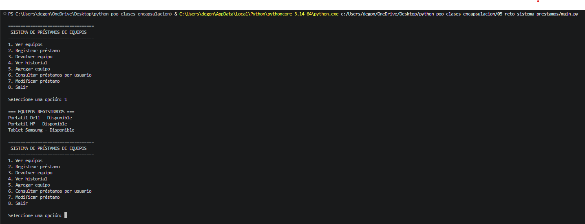
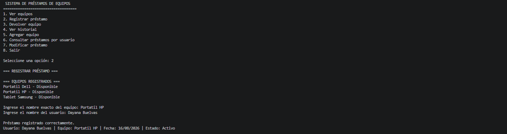
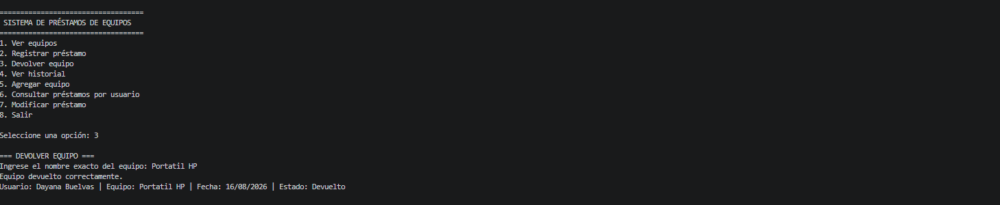
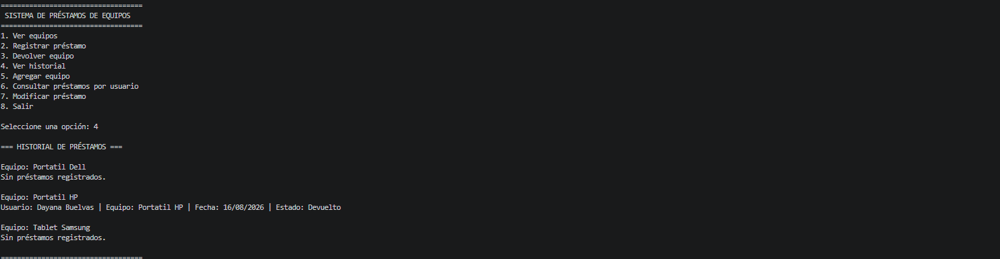

# Fundamentos de Python: Clases, Objetos y Encapsulación

## GA1-220501093-04-AA1-EV04

Este repositorio contiene el desarrollo de la evidencia relacionada con los fundamentos de
Programación Orienta a Objetos (POO) en Python.

Durante la actividad se trabajaron conceptps como clases, objetos, constructores, atributos,
métodos, encapsulación, propiedades y métodos privados. Finalmente, esos conocimientos
fueron aplicados en el reto integrador **Sistema de Préstamos de Equipos**.

---

## Estructura del repositorio

El proyecto está organizado de la siguiente manera:

- `01_ejemplos_clases_objetos/`: ejemplos prácticos sobre clases, objetos, constructores, atributos y métodos.
- `02_ejemplos_encapsulacion/`: ejemplos relacionados con atributos privados, getters, setter, propiedades y métodos privados.
- `03_taller_clases_objetos/`: desaroollo del Taller de Clases y Objetos mediante la clase `Libro`.
- `04_taller_encapsulacion/`: desarrollo del Taller de Encapsulación mediante la clase `CuentaBancaria`.
- `05_reto_sistema_prestamos/`: implementación del sistema de Préstamos de Equipos aplicando Programación Orientada a Objetos.

---

# Clases y objetos

Una clase funciona como una plnatilla que permite definir las características y comportamientos que tendrán los objetos.

Durante los ejercicios se utilizaron constructores mediante el método `__init__`, atributos de instancia,
atributos de clase y diferentes tipos de métodos.

Los objetos permiten crera la instancias independientes de una clase, cada una con sus propios datos.

---

# Encapsulación

La encapsulación permite contrilar el acceso y modificación de los datos internos de una clase.

Durante la actividad se utilizaron atributos protegidos mediante `_atributo`, atributos privados mediante `__atributo`, getters y setters, propiedades mediante `@property` y métodos privados.

Esto permite proteger los datos y aplicar validaciones antes de realizar modificaciones.

---

# Taller de Clases y Objetos

En este taller se desarrolló una clase `Libro` con los siguientes atributos:

- `titulo`
- `autor`
- `paginas`
- `disponible`

También se implementaron los métodos:

- `prestar()`
- `devolver()`
- `informacion()`

Se crearon diferentes objetos de la clase `Libro` para comprobar el funcionamiento de los métodos y los cambios en el estado de disponibilidad.

---

# Taller de Encapsulación

En el taller de Encapsulación se desarrolló la clase `CuentaBancaria`.

La clase contiene los atributos:

- `_titular`
- `_saldo`

Se utilizaron propiedades para controlar el acceso a estos datos.

La propiedad `titular` es de solo lectura, mientras que la propiedad `saldo` permite modificar el valor únicamente cuando el nuevo saldo no es negativo.

También se implementaron los métodos:

- `depositar(cantidad)`
- `retirar(cantidad)`

De esta manera se evita realizar operaciones que puedan dejar la cuenta con valores inválidos.

---

# Reto: Sistema de Préstamos de Equipos

Como actividad integradora se desarrolló el **Sistema de Préstamos de Equipos**,
transformando el proyecto base en una solución basada en programación Orientasa a Objetos.

## Clase Equipo

Representa los equipos registrados en el inventario.

Contiene información como el nombre del equipo y su disponibilidad.

La disponibilidad se encuentra encapsulada mediante el atributo `_disponible`.

La clase permite:

- Prestar un equipo.
- Devolver un equipo.
- Consultar su disponibilidad.
- Mantener un historial de préstamos.

## Clase Usuario

Representa las personas que solicitan equipos.

Cada usuario tiene un nombre y una colección donde se almacenan los préstamos asociados.

## Clase Prestamo

Representa la relación entre un usuario y un equipo.

Cada préstamo almacena:

- Usuario.
- Equipo.
- Fecha.
- Estado del préstamo.

El estado se encuentra encapsulado mediante `_activo`.

La clase permite registrar la devolución y modificar información relacionada con el préstamo.

---

# Colecciones utilizadas

El sistema utiliza diferentes estructuras de datos de Python.

### Listas

Se utilizan para almacenar el historial de préstamos y los préstamos asociados a los usuarios.

### Diccionarios

Se utilizan para organizar los equipos y usuarios registrados en el sistema.

Esto permite realizar búsquedas utilizando el nombre como clave.

---

# Funcionalidades del sistema

El menú principal permite realizar las siguientes operaciones:

1. Ver equipos.
2. Registrar préstamo.
3. Devolver equipo.
4. Ver historial de préstamos.
5. Agregar un nuevo equipo.
6. Consultar préstamos por usuario.
7. Modificar un préstamo.
8. Salir del programa.

El sistema realiza validaciones para evitar prestar equipos que no estén disponibles, devolver equipos que ya se encuentren disponibles o registrar información inválida.

---

# Ejemplos de ejecución

## Visualización de equipos

El sistema permite consultar los equipos registrados y conocer si están disponibles o prestados.

**Captura de ejecución:**

## Registro de préstamo

Al seleccionar la opción de registrar préstamo, el sistema solicita el equipo y el usuario. Después actualiza automáticamente la disponibilidad del equipo.

**Captura de ejecución:**

## Devolución de equipo

Cuando se devuelve un equipo, el préstamo cambia su estado y el equipo vuelve a quedar disponible.

**Captura de ejecución:**

## Historial de préstamos

El sistema conserva los préstamos realizados y permite consultar el historial correspondiente.

**Captura de ejecución:**

# Reflexión personal

El desarrollo de esta actividad me permitió comprender mejor cómo funciona la Programación Orientada a Objetos en Python y cómo se pueden representar elementos de un problema real mediante clases y objetos.

Al desarrollar los ejemplos y talleres comprendí la diferencia entre una clase y un objeto, el funcionamiento del constructor `__init__` y la manera en que los atributos y métodos permiten definir el estado y comportamiento de los objetos.

Uno de los conceptos más importantes fue la encapsulación, ya que permite proteger ciertos datos y controlar la forma en que pueden ser consultados o modificados.

El reto del Sistema de Préstamos de Equipos me permitió integrar los conocimientos adquiridos, utilizando las clases `Equipo`, `Usuario` y `Prestamo`, además de listas y diccionarios para organizar la información.

La principal dificultad fue comprender cómo relacionar diferentes objetos entre sí y actualizar correctamente sus estados durante un préstamo o una devolución. Al realizar las pruebas en consola pude identificar cómo interactúan las clases y comprender mejor la utilidad de la POO para desarrollar programas más organizados, reutilizables y fáciles de mantener.

---

# Tecnologías utilizadas

- Python
- Visual Studio Code
- Git
- GitHub

---

# Autor

Dennis González

Programa de formación: **Análisis y Desarrollo de Software - SENA**
